## Python环境
### Python安装
>Mac版[Python3.8.2下载](https://www.python.org/ftp/python/3.8.2/python-3.8.2-macosx10.9.pkg)
>安装点击下一步下一步完成即可。

### 官方pip安装
>安装pip
>
>请通过命令`curl https://bootstrap.pypa.io/get-pip.py -o get-pip.py`下载**get-pip.py**然后在下载的文件夹中运行该命令`sudo python get-pip.py
`
>
> **升级PIP**
>```python
>pip install -U pip3
>```

### virtualenv安装
>```python
>pip3 install virtualenv
>```

### virtualenvwrapper安装
>```python
>pip3 install virtualenvwrapper
>```

### 创建虚拟环境文件目录
>```linux
>mkdir ~/.virtualenvs
>```
### 编辑.bash_profile文件
>```linux
>export WORKON_HOME='~/.virtualenvs'
>export VIRTUALENVWRAPPER_PYTHON='/Library/Frameworks/Python.framework/Versions/3.8/bin/python3'
>source /Library/Frameworks/Python.framework/Versions/3.8/bin/virtualenvwrapper.sh
>```
>**重新加载配置**
>```linux
>source ~/.bash_profile
>```
>**创建项目**
>```linux
>进入.virtualenvs目录创建项目
>python3 -m venv tor
>```
>**workon+项目名称 激活项目**
>```linux
>workon tor
>```
>**退出虚拟环境**
>```linux
>deactivate
>```
>
### Mac本地Pycharm新建项目
> 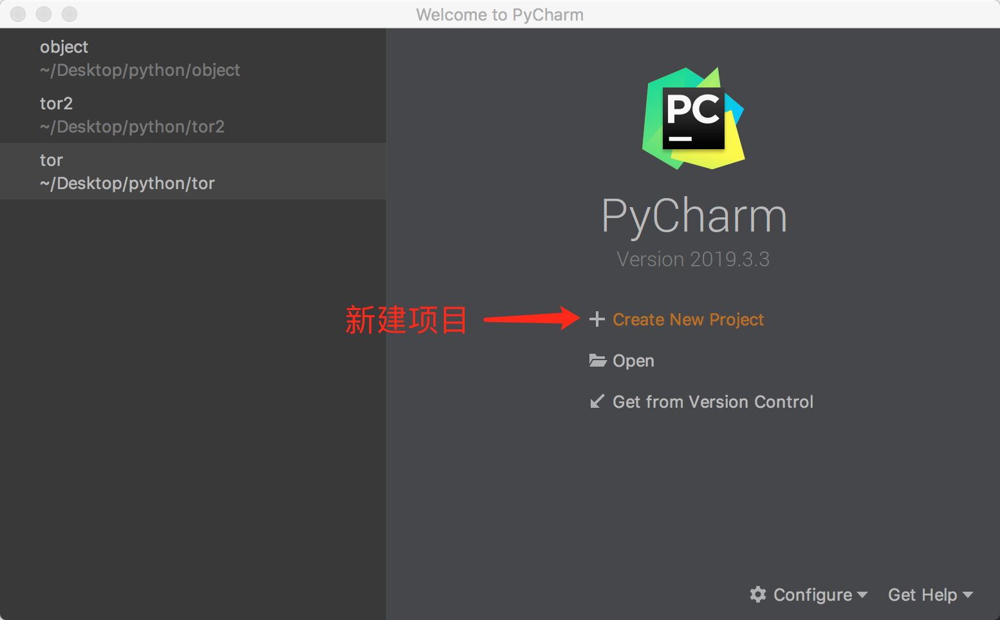
> 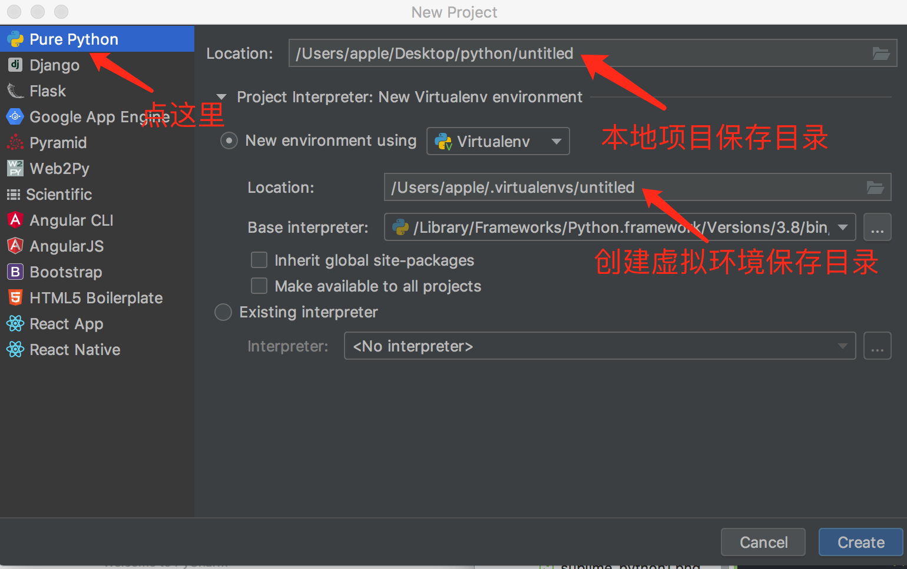

## **PyCharm**
### PyCharm删除日志
>```linux
>cd ~/Library/PreferenceS
>rm -rf PyCharm2019.3
>
>cd ~/Library/Logs
>rm -rf PyCharm2019.3
>
>cd ~/Library/Application\ Support/
>rm -rf PyCharm2019.3
>
>cd ~/Library/Caches
>rm -rf PyCharm2019.3
>```

### PyCharm 2019.3.3激活破解教程（永久)
>
>2019.12.02 jetbrains公司发布了Python的最强编辑器PyCharm2019.3版本。本次大版本主要对MongoDB、Python3.8功能做了一些增加。

#### 一、激活前注意事项
>1. PyCharm一定要是在官网下载：https://www.jetbrains.com/pycharm/download/
>2. 本教程适用于PyCharm所有版本
>3. 本教程适用于jetbrains全系列产品（Pycharm）
>4. 不需要修改hosts文件，如果修改请移除jetbrains相关的项目
>5. 配置文件修改已经不在bin目录下直接修改，而是通过pycharm修改

#### 二、激活教程
>1. [补丁下载](https://pan.baidu.com/s/1RJ7oyNqyLC_a88yl8CK_gw)密码:epua
>2. 添加破解补丁到PyCharm指定目录
打开应用目录进入/Applications/PyCharm.app/Contents/bin/目录，把破解补丁jetbrains-agent.jar放入bin目录内
>3. 修改配置文件
>进入到项目界面后，点击Pycharm最上面的菜单栏中的 “Help” -> “Edit Custom VM Options
>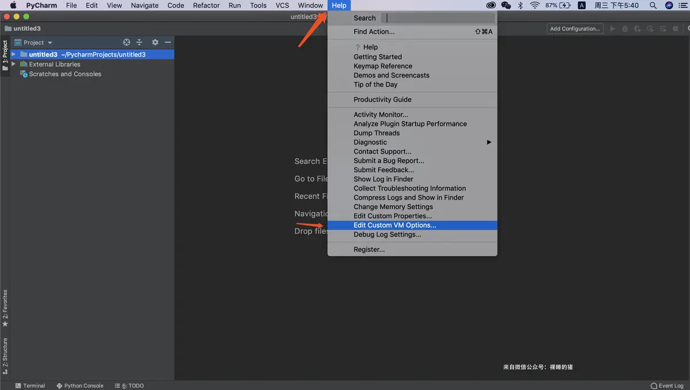
>4. 编辑破解补丁目录
>在打开的vmoptions编辑窗口末行添加：`-javaagent:/Applications/PyCharm.app/Contents/bin/jetbrains-agent.jar`请仔细检查补丁路径是否正确，如果错误则会出现pycharm打不开的情况。
>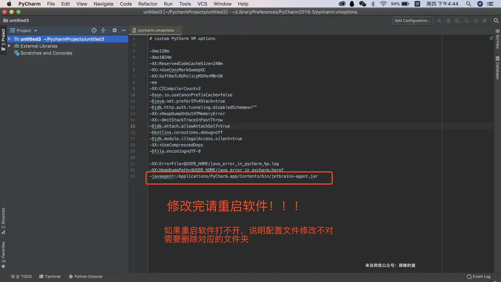

### PyCharm Pro配置数据库
> 必须在项目内安装`pymysql`python插件才可以显示数据库

## **MacSublimeText3环境**
### Sublimetext3安装
> [官方下载Sublimextext3 for Mac](https://download.sublimetext.com/Sublime%20Text%20Build%203211.dmg)

#### 测试环境
> mac 10.12.6
>
>Sublime Text 3(3211)

#### 激活方法
>hosts文件修改
>```linux
>sudo vim /etc/hosts
>```
追加一下内容
>
> ```
> 127.0.0.1 www.sublimetext.com
> 127.0.0.1 sublimetext.com
> 127.0.0.1 sublimehq.com
> 127.0.0.1 license.sublimehq.com
> 127.0.0.1 45.55.255.55
> 127.0.0.1 45.55.41.223
> 0.0.0.0 license.sublimehq.com
> 0.0.0.0 45.55.255.55
> 0.0.0.0 45.55.41.223
>```
> 保存关闭即可。
#### 激活注册
> 打开SublimeText3 ==> Help ==> Enter License打开填写如下key
> ```
> ----- BEGIN LICENSE -----
> Member J2TeaM
> Single User License
> EA7E-1011316
> D7DA350E 1B8B0760 972F8B60 F3E64036
> B9B4E234 F356F38F 0AD1E3B7 0E9C5FAD
> FA0A2ABE 25F65BD8 D51458E5 3923CE80
> 87428428 79079A01 AA69F319 A1AF29A4
> A684C2DC 0B1583D4 19CBD290 217618CD
> 5653E0A0 BACE3948 BB2EE45E 422D2C87
> DD9AF44B 99C49590 D2DBDEE1 75860FD2
> 8C8BB2AD B2ECE5A4 EFC08AF2 25A9B864
> ------ END LICENSE ------
> ```
> 注册成功
>
#### Package Control
> 安装package control组件，然后直接在线安装按``` control+` ```（此符号为tab按键上面的按键) 调出console)输入如下代码
> ```
> import urllib.request,os; pf = 'Package Control.sublime-package'; ipp = sublime.installed_packages_path(); urllib.request.install_opener( urllib.request.build_opener( urllib.request.ProxyHandler()) ); open(os.path.join(ipp, pf), 'wb').write(urllib.request.urlopen( 'http://sublime.wbond.net/' + pf.replace(' ','%20')).read())
> ```
> 回车等待下载完成即可。

#### Package Control安装插件的方法

> - 按下Commadn+Shift+P调出命令面板
> - 输入install 调出 Install Package 选项并回车，然后在列表中选中要安装的插件。

#### Sublime Text3 自动保存配置

> **Sublime Text ==> Preferences ==> settings**
>
> 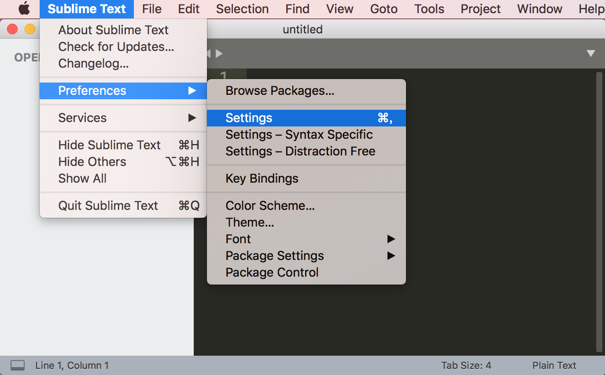
>
> 现在分两边了,左边文件是默认配置，右边文件是用户自定义配置，左边是只读的不能编辑,在左边ctrl + f ,然后在下面输入框里输入save_on_focus_lost，在右边文件中设置为true。保存文件即可。
>
> 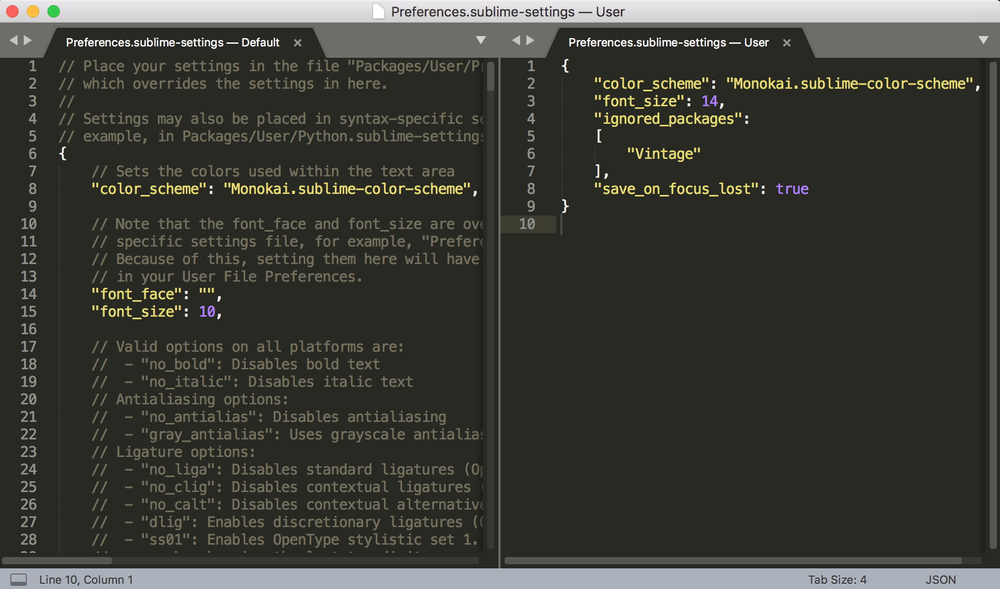
>
>```json
>{
>	"color_scheme": "Monokai.sublime-color-scheme",
>	"font_size": 14,
>	"ignored_packages":
>	[
>		"Vintage"
>	],
>	"save_on_focus_lost": true
>}
>```
>
#### Sublime Text3更换为国内更新源

> **Sublime Text ==> Preferences ==> Package settings ==> Package Control ==> Settings-User**
>
> 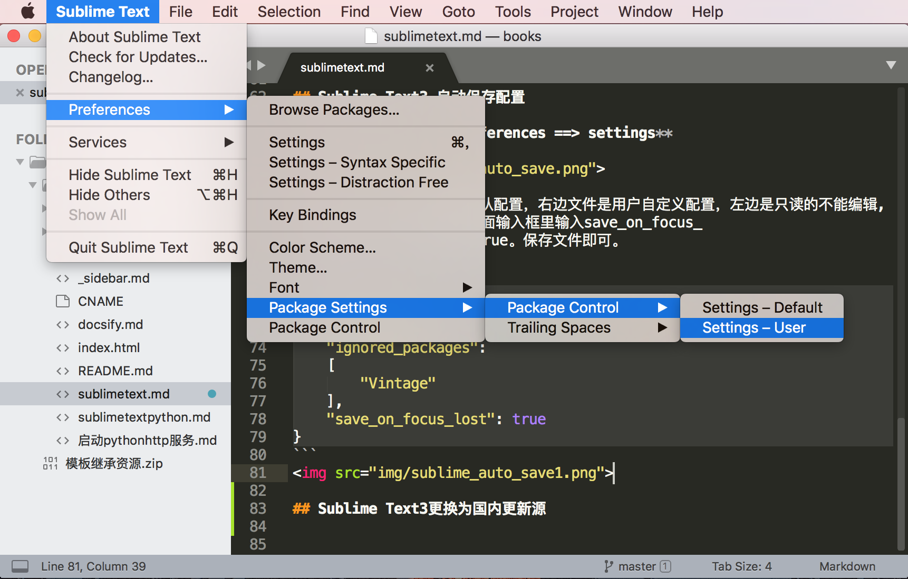
>
> 跟换为如下更新源代码
>
>```
>{
>	"bootstrapped": true,
>	"channels":
>	[
>		"https://raw.githubusercontent.com/HBLong/channel_v3_daily/master/channel_v3.json",
>        "https://raw.githubusercontent.com/wilon/sublime/master/download/channel_v3.json"
>	],
>	"in_process_packages":
>	[
>	],
>	"installed_packages":
>	[
>		"1Self",
>		"Package Control",
>		"TrailingSpaces"
>	]
>}
>```
>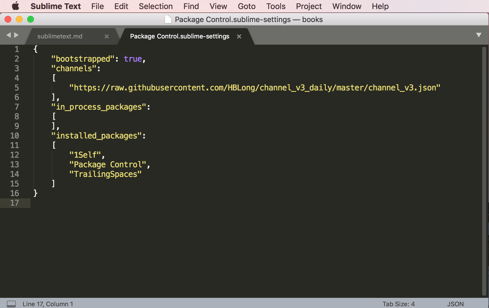
### sublimeText3插件安装

#### SFTP同步文件到服务器
>SFTP插件可以同步文件到远程服务器
>
>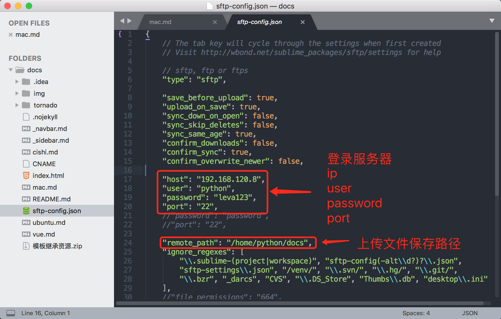
#### 文件前面显示图标
> A File Icon
>```linux
> A File Icon
>```
>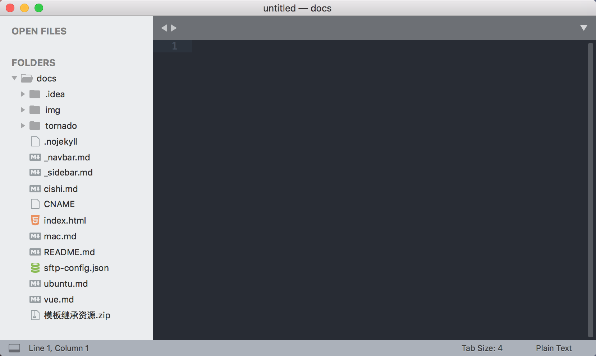
####  TrailingSpaces
> - 高亮显示空格和tab键
> - 一键去除多余空格和Tab建
>通过Package Control在线安装
>
> 配置快捷键
> **Sublime Text ==> Preferences ==> Key Bindings**
>
> 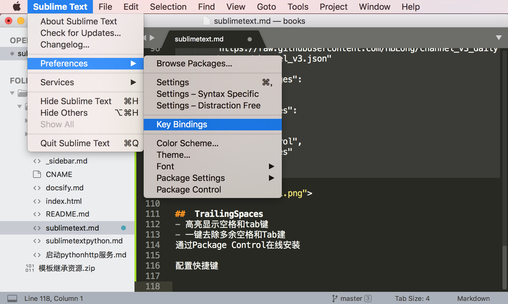
>
> 配置如下代码
>```
>[
>{
>"keys":["ctrl+alt+r"],
>"command": "delete_trailing_spaces"
>}
>]
>```
> 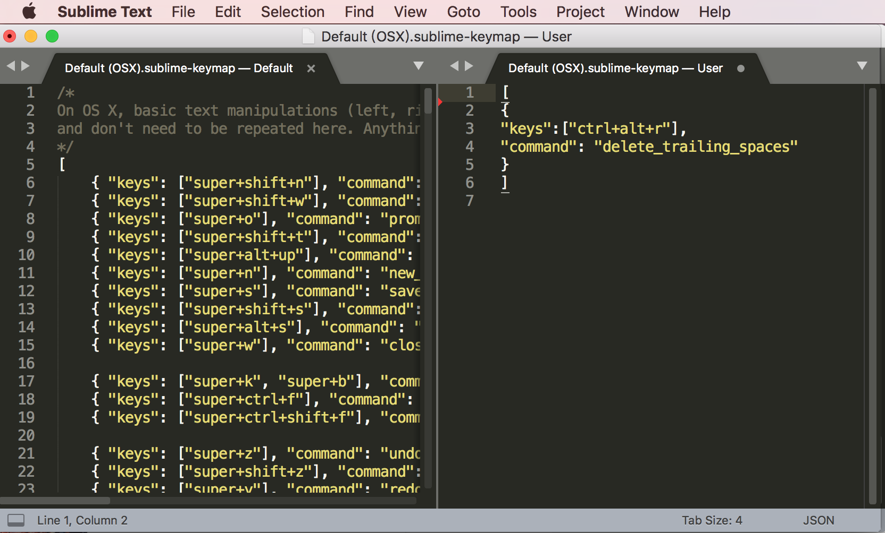

#### command+b 执行python程序

>打开 Tool ==> Build system ==> new Build System 如下图
>
> 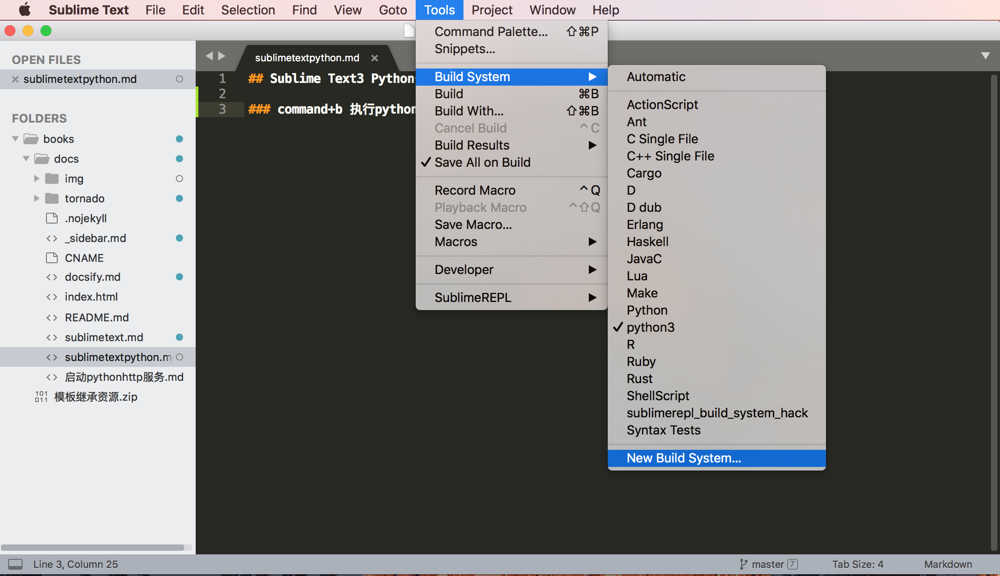
>
> 配置如下代码既可以实现command+b运行python程序
>
>```linux
>保存名字为python3.sublime-build
>{
>	"cmd": ["/usr/local/bin/python3", "-u", "$file"],
>}
>```
>
> 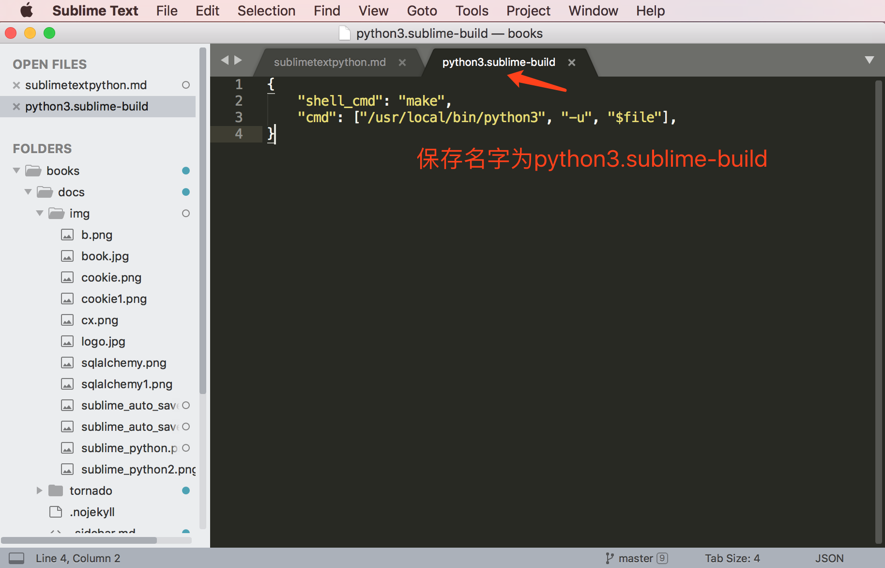
>
>配置好以上代码设置执行程序python3如下图设置
>
> 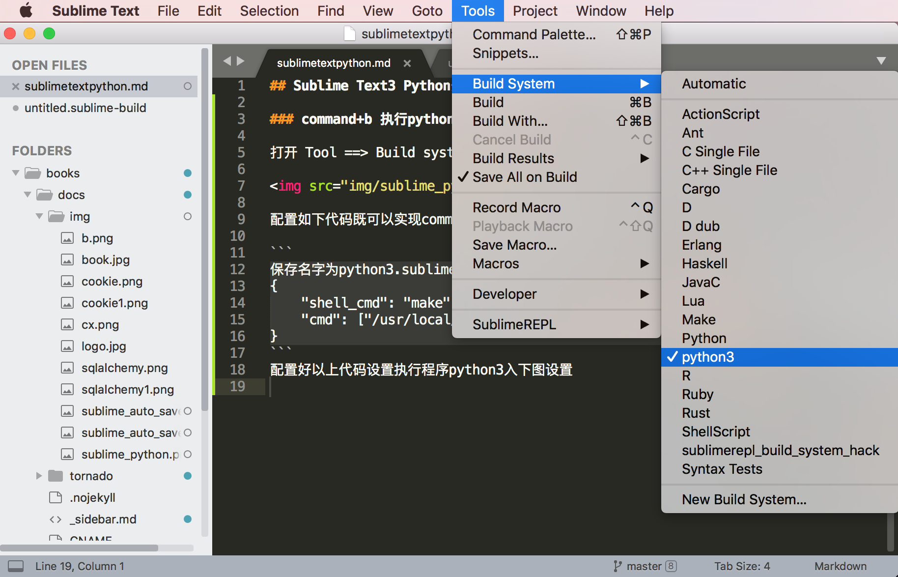