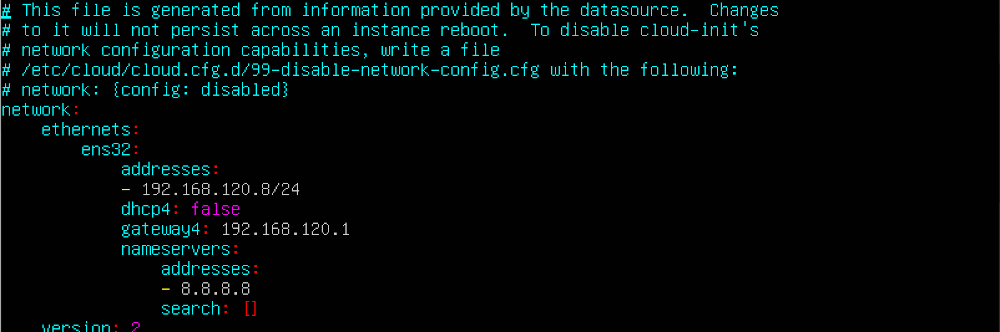
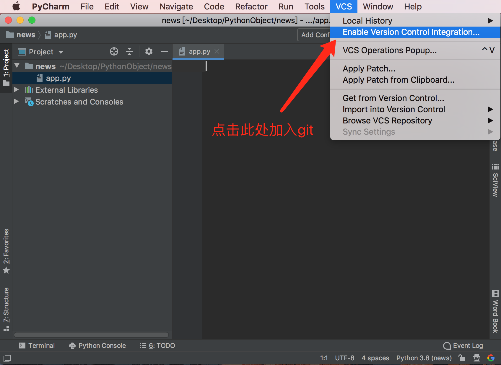
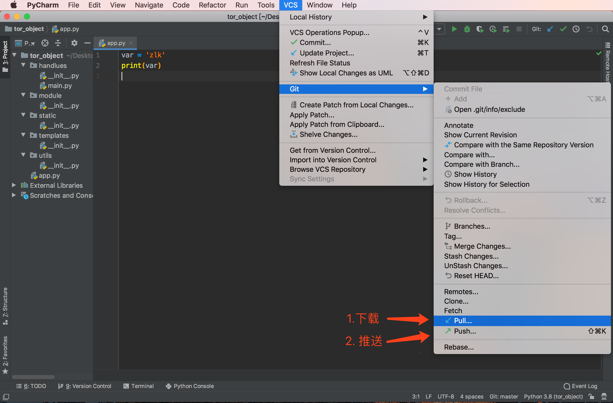

## **Ubuntu 安装python虚拟环境**
### 测试Ubuntu版本
> - Ubuntu Desktop 19.04

### 安装Python3和pip3
> ```linux
>sudo apt-get update
>sudo apt-get install python3
>sudo apt-get install python3-pip
> ```

### 安装virtualenv和virtualenvwrapper
>``` linux
>pip3 install virtualenv
>pip3 install virtualenvwrapper
>```

### 创建目录用来存放虚拟环境
>```linux
>mkdir $HOME/.virtualenvs
>```

### 编辑~/.bahsrc文件，并添加如下内容
> - 查看python3目录`which python3`命令
> - 使用`sudo find / -name virtualenvwrapper.sh`查看路径
>```linux
>export WORKON_HOME=$HOME/.virtualenvs
>export VIRTUALENVWRAPPER_PYTHON=/usr/bin/python3
>export VIRTUALENVWRAPPER_VIRTUALENV=~/.local/bin/virtualenv
>source ~/.local/bin/virtualenvwrapper.sh
>```
> **重新加载配置**
>
>```linux
>source ~/.bashrc
>```
>
### 创建虚拟环境
> **mkvirtualenv -p (指定python版本号) 项目名称**
>```linux
>mkvirtualenv -p python3 tor
>```
> **切换虚拟环境**
>```linux
>workon tor
>```
> **退出虚拟环境**
>```linux
>deactivate
>```
>**删除运行环境**
>```linux
>rmvirtualenv tor
>```
>**列出可用虚拟环境**
>```linux
>workon 或 lsvirtualenv
>```
> **列出当前环境安装包**
>```linux
>lssitepackages
>```
## **Mysql**
> **打开终端，输入:`sudo apt-get update`更新数据**
>```linux
>sudo apt-get update
>输入root用户密码
>等待更新完毕
>```
### 开始安装mysql
>```linux
>sudo apt-get install mysql-server
>提示用户是否安装mysql，是输入:y，否输入。
>```
>**启动Mysql的时候必须有root权限启动，否则无法启动Mysql**
>
### 启动mysql
>**默认Mysql的root用户密码为空**
>```linux
>sudo mysql -uroot -p+回车直接登录mysql
>```

### Mysql创建用户
>```liunx
>sudo mysql -uroot -p回车登录数据库
>创建用户
>%表示任意IP可以访问本数据库，可以指定IP或localhost访问数据库
>create user 'username'@'%' identified by 'userpassword';
>```

#### 查看当前用户
>```linux
>select user();
>```

#### 用户授于远程访问所有权限
>```linux
>grant all privileges on *.* to 'username'@'%' WITH GRANT OPTION;
>立即生效
>flush privileges;
>```

#### 修改配置文件，允许远程登录
>```linux
>sudo vim/etc/mysql/mysql.conf.d/mysqld.cnf
>修改前bind-address
>bind-address =127.0.0.1
>修改后bind-address
>bind-address =0.0.0.0
>```

#### 查看远程登录账号
> **查看远程访问权限**
>```linux
>use mysql 进入mysql查看权限
>select user,host from mysql.user;
>```

#### 查看端口情况
>3306端口默为mysql，若显示监听，表示安装成功。
>```linux
>netstat -tan |grep 3306
>netstat -tulpen 
>```


#### 重启Mysql
> 修改配置文件必须重启Mysql才生效
>```linux
>sudo service mysql restart
>```

### 创建数据库
>```linux
>create database mydb;
>```
>
#### 设置数据库编码为utf8
>```linux
>alter database mydb character set utf8;
>查看数据库编码
>show create database 数据库名称 \G
>```
#### 查看数据库
>```linux
>show databases;
>```
#### 删除数据库
>```linux
>drop database dbname;
>```
#### 查看数据库位置
>```linux
>select databases();
>+-----------------+
>| databases()     |
>| NULL            | 表示没有进入任何数据库
>+-----------------+
>```
#### 进入数据库
>```linux
>mysql> use mydb
>Database changed
>mysql> select database();
>+------------+
>| database() |
>+------------+
>| mydb       |
>+------------+
>```
#### 创建数据库表
>```linux
>create table tablaneme(
>	id int,
>	name varchar(10)
>	);
>```
#### 查看表结构
>```linux
>desc tablename;
>```
#### 查看表
>```linux
>show tables;
>```
#### 删除表
>```linux
>drop table tablename;
>```

### 退出Mysql
>```linux
>quit
>```

## **Redis安装**
> **打开终端，输入:`sudo apt-get updata`更新数据**
>```linux
>sudo apt-get updata
>输入root用户密码#### 设置数据库编码为utf8
>```linux
>alter database mydb character set utf8;
>查看数据库编码
>show create database 数据库名称 \G
>```
>等待更新完毕

### 开始安装Redis
>```linux
>sudo apt-get install redis-server
>提示用户是否安装Redis，是输入:y，否输入。
>```
>
### 启动Redis
>```linux
>redis-server
>```

### 查看Redis是否在运行
>```linux
> ps -ef | grep redis     --> 查看进程
> netstat -an | grep 6379 --> redis的端口号是6379
> redis-cli               --> 查看redis
>```
## **Mongodb**

### 1. mongodb安装
>安装
>```linux
>sudo apt-get update
>sudo apt-get install -y mongodb
>```

### 2. mongodb操作
####  进入mongodb数据命令
>```linux
>mongo
>```
#### 创建库与集合
>切换/创建数据库
>```linux
>use dbname
>```
> 显示所有数据库
>```linux
>show dbs
>```
>查看所在库
>```linux
>db
>```
>删除库
>```linux
>db.dropDatabase()
>```
>显示当前数据库的集合
>```linux
>show collections
>```
>创建集合
>```linux
>db.createCollection('name')
>```
>删除集合
>```linux
>db.name.drop()
>```

#### 增 删 改 查
>增加数据方法
>```linux
>插入单条json格式数据
>db.stu.insert({name: 'zlk',age: 35,})
>
>插入多条数据
>db.stu.insert([
>   {name:'ubnt',age:182,sex:'M'},
>   {name:'abc',age:32,sex:'M'},
>   {name:'uu',age:33,sex:'F'}
>])
>```
>自定义插入id和一条数据**id必须是唯一的**
>```linux
>db.stu.insert({"_id":1,name: 'uc',age: 35,})
>```
>查数据方法
>```linux
>查询集合中所有数据
>db.stu.find()
>
>指定单条件查询
>db.stu.find({age:37})
>
>指定多条件查询
>db.stu.find({age:35,sex:'M'})
>
>格式化显示
>db.stu.find({age:37}).pretty()
>```
> **逻辑运算查询**
>- and条件
>- or条件
>- and和or混用
>------------------------
>- $ne  不等于
>- $gt  大于
>- $lt  小于
>- $gte 大于等于
>- $lte 小于等于
>------------------------
>gte查询
>```linux
>db.stu.find({age:{"$gte":35}})
>```
>and查询
>```linux
>db.stu.find({$and:[{sex:'M'},{age:35}]})
>```
>or查询
>```linux
>db.stu.find({$or:[{$and:[{sex:'M'},{age:37}]},{$and:[{sex:'F'},{age:37}]}]})
>```
>改数据方法
>
>删数据方法

#### 创建用户

### 3. python操作mongodb


## **ubuntu创建新用户与组和目录**
>注意要在后面加-m，否则不会在home路径下创建该用户的文件夹
>```linux
>sudo useradd username -m
>```
>
>执行```cat /etc/passwd```可以查看passwd文件中是否有刚才添加的用户名，如果有，则表示添加成功

### 新用户设置密码
>```linux
>sudo passwd username
>```
>在弹出来的提示窗口中设置密码即可

### 查看新的用户
>```linux
>cat /etc/passwd | grep username
>```
### 新用户增加sudo权限
>在使用Linux系统过程中，通常情况下，我们都会使用普通用户进行日常操作，而root用户只有在权限分配及系统设置时才会使用，而root用户的密码也不可能公开。普通用户执行到系统程序时，需要临时提升权限，sudo就是我们常用的命令，仅需要输入当前用户密码，便可以完成权限的临时提升。在使用sudo命令的过程中，我们经常会遇到当前用户不在sudoers文件中的提示信息，解决方法如下

#### 修改/etc/sudoers权限
>```
>sudo chmod u+w /etc/sudoers
>```
>增加写权限

##### 编辑/etc/sudoers
>```sudo vim /etc/sudoers
>username ALL=(ALL:ALL) ALL
>```
>在root用户下面增加，username为新的用户，根据需要自sing修改

#### 恢复原来/etc/sudoers权限
>```linux
>sudo chmod u-w /etc/sudoers
>```

### 新用户远程登录无法显示路径
>```linux
>sudo vim /etc/passwd
>username:x:1002:1002::/home/gitbook:/bin/sh
>改为
>gitbook:x:1002:1002::/home/gitbook:/bin/bash
>```

### 组
#### 组查看方法
>```linux
>groups
>```
>查看groups当前用户所在组

####  查看用户所在组
>```linux
>groups username
>```
#### 查看ID在所属组
>```linux
>id username
>```

#### 直接查看组文件 more /etc/group
>```linux
>more /etc/group
>```

### 删除用户
>加上-r可以删除/home/路径下的用户文件夹，否则不能
>```linux
>sudo userdel -r username
>```
### 删除组
>```linux
>groupdel users
>```
## **ubuntu静态ip设置方法**
>编辑`sudo vim /etc/netplan/50-cloud-init.yaml`文件
>内容如下
>```linux
>network:
>    ethernets:
>        ens32:
>            addresses:
>            - 192.168.120.8/24
>            dhcp4: false
>            gateway4: 192.168.120.1
>           nameservers:
>                addresses:
>                - 8.8.8.8
>                search: []
>    version: 2
>```
>
>`
>
>重新加载配置
>```linux
>sudo netplan apply
>```
>**说明**
>- ens33:网络接口名称
>- dhcp4:接收IPV4接口的dhcp属性
>- dhcp6:接收IPV6接口的dhcp属性
>- addresses:接口的静态地址序列
>- gateway4:默认网关的IPV4地址
>- Nameservers:DNS服务器地址

## **Linux 常用命令**

### ubuntu root密码设置
>```
>sudo passwd root
>new password:输入新密码
>Retype new password:再次输入新密码
>Passwd:password updated successfully 密码更新成功
>```
### ubuntu主机名修改
>```
>hostname 查看主机名称
>
>sudo vi /etc/hostname
>
>```
### ssh连接远程服务器
>```linux
>ssh user@ip+回车输入密码登录
>```
### tree根据文件层级列出目录
>```linux
>tree -L 2
>```

### 端口查看命令
>```linux
>sudo netstat -ntlp
>sudo kill -9 PID进程号
>```


## **Ubuntu+Git+PyCharm**
### 服务器安装Git
>```linux
>sudo apt-get install git
>```
#### 服务器配置

>服务器端Git用户设置
>```linux
>sudo useradd git 创建用户
>passwd git 为git用户设置密码
>
>vim /etc/passwd 阻止git用户组的ssh登录
>git:x:1001:1001::/home/git:/bin/sh 未改前
>git:x:1001:1001::/home/git:/usr/bin/git-shell 修改后
>```
>
>配置git用户名和邮箱，与Git交互都会使用该信息
>```linux
>git config --global user.name “name"       设置用户名
>git config --global user.email "email@gmail.com”  设置邮箱
>```
>
>新建git一个空仓库
>```linux
>mkdir /home/git 创建一个存储仓库目录
>cd /home/git  进入仓库目录
>
>git init --bare object.git 建立一个空项目仓库
>Initialized empty Git repository in /home/git/object.git 提示空项目仓库建立成功
>sudo chown -R git:git object.git （将owner改为git）
>```

### 本地安装Git
>```linux
>sudo apt-get install git
>
>配置git用户名和邮箱，与Git交互都会使用该信息
>
>git config --global user.name “name"       设置用户名
>git config --global user.email "email@gmail.com”  设置邮箱
>
>查
>git config --global --list
>git config --global user.name
>增
>git config  --global --add user.name jianan
>删
>git config  --global --unset user.name
>改
>git config --global user.name jianan
>```
#### 本地克隆Git库
>进入到指定目录克隆服务器库
>```linux
>git clone git@192.168.120.227:/home/git/object.git
>```
>
#### PyCharm 下载和推送到服务器
>

# UbuntuVim配置
## 1. vim 未命名文档保存
>- 按键盘Esc后输入`:file 空格 filename+后缀`回车
>- 输入`:wq`回车 保存并退出

## 2. vim内列出所有文件
>在vim内按Ese输入`:!ls`回车列出所有文件名称

## 3. vim内打开一个文件
>按Esc输入`:vsp 空格 filename`回车

## 4. vim文件详细路径
>按Ese输入`:!pwd`回车文件详细路径

## 5. vim删除所有内容
>按键盘Esc输入`:%d`

## 6. vim快速切换到每行的头尾方法
>按键盘ctrl+键盘左右快速定位到行头和行尾

## 7. vim快速切换到首行
>按Esc后，按gg到首行